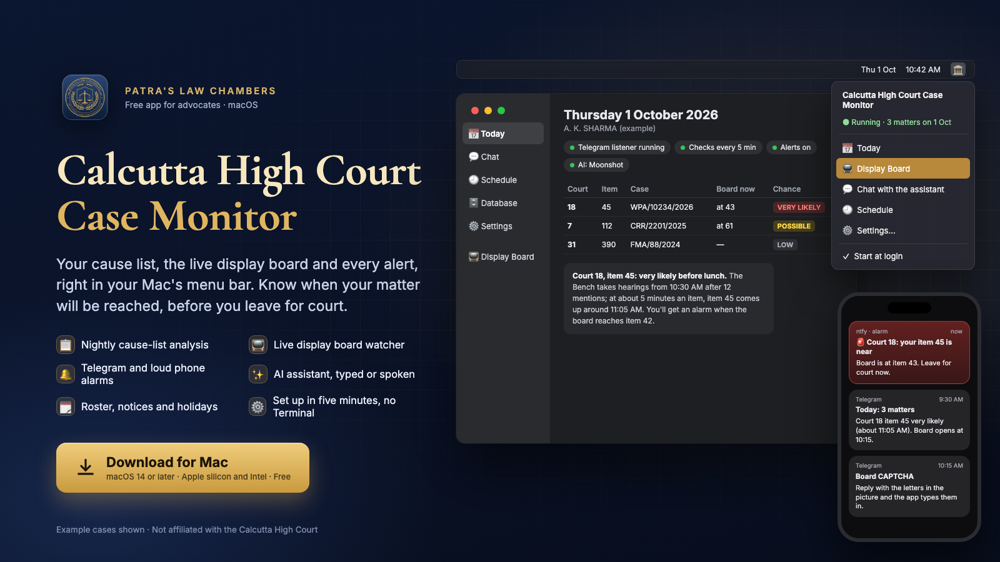
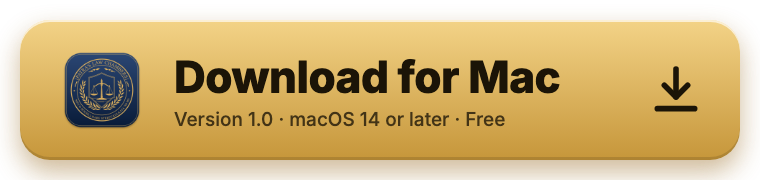
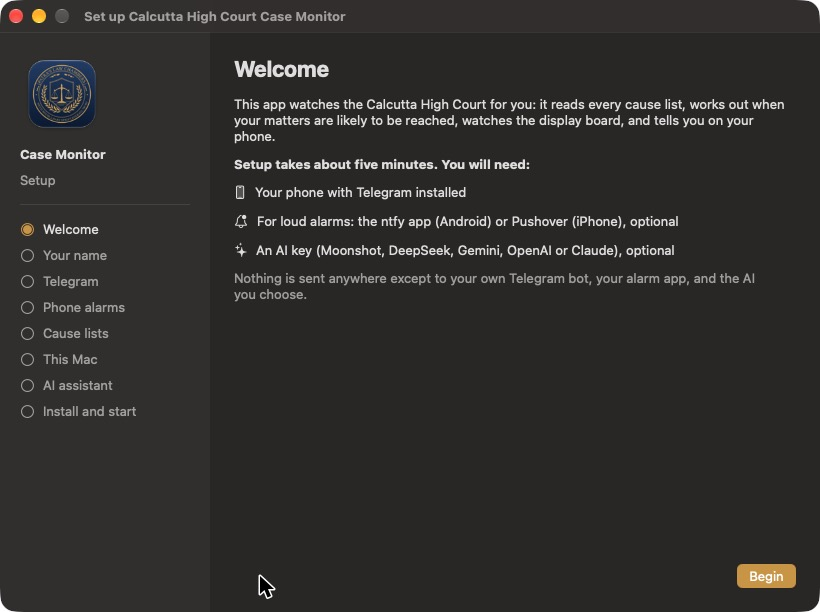
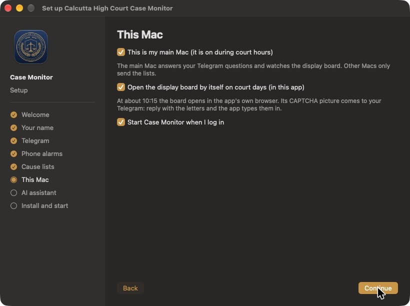
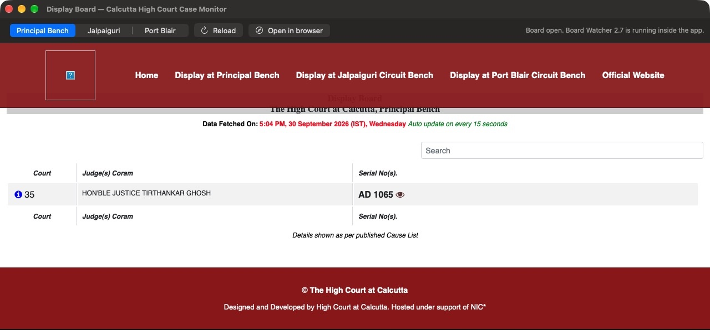
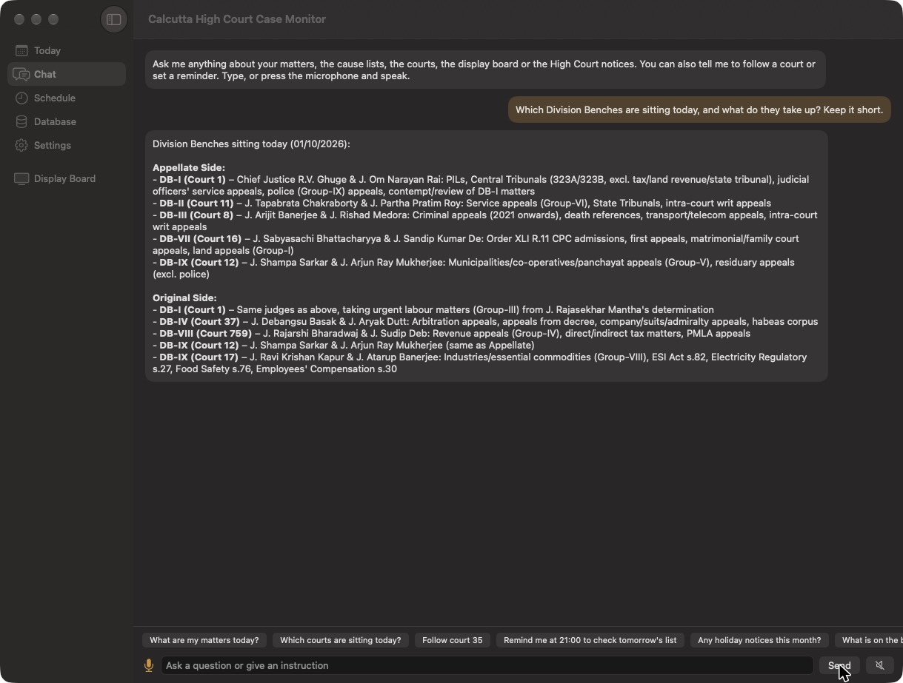
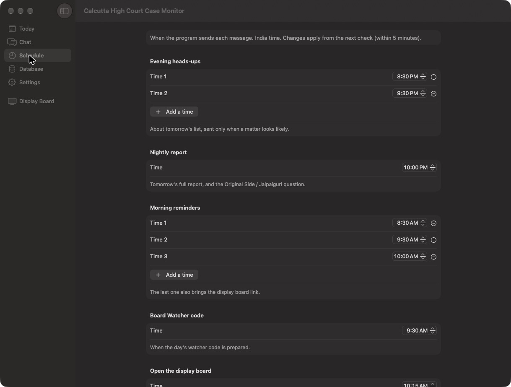
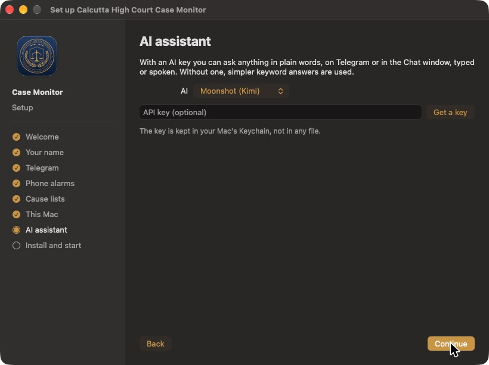

# Calcutta High Court Case Monitor for Mac

**Your cause list, the live display board and every alert, right in your Mac's menu bar.** 
A free app for advocates practising before the Calcutta High Court, by Patra's Law Chambers.

 

Version 1.0 · macOS 14 Sonoma or later · Apple silicon and Intel · Free 
[Web page](https://advocatesudippatra-spec.github.io/calcutta-high-court-case-monitor-mac/) · [Full manual](https://advocatesudippatra-spec.github.io/calcutta-high-court-case-monitoring-system/) · [Monitoring program (open source)](https://github.com/advocatesudippatra-spec/calcutta-high-court-case-monitoring-system)

---

## What it does

Every night the app reads the Calcutta High Court's cause lists, finds your matters, and works out how likely each
one is to be reached, from the Bench's determination, its notes and the day's timetable. In the morning it reminds
you. At about 10:15 it opens the official display board inside the app, watches it, and rings your phone when your
item is near. Everything comes to your own Telegram bot and, for loud alarms, the ntfy (Android) or Pushover (iPhone)
app.

| | |
|---|---|
| 📋 **Nightly cause-list analysis** | Your matters in the daily, supplementary and monthly lists, with the chance of being reached and why |
| 📺 **Built-in display board** | The official board opens in the app with the Board Watcher running inside: no Chrome, no extension |
| 🔔 **Telegram and loud phone alarms** | Heads-up at night, reminders in the morning, an alarm when your item is near or its heading closes |
| 🔐 **CAPTCHA on your phone** | The board's CAPTCHA picture comes to Telegram; reply with the letters and the app types them in |
| ✨ **AI assistant** | Ask anything in plain words, typed or spoken, in the app or on Telegram (Moonshot, DeepSeek, Gemini, OpenAI or Claude, your own key) |
| 🗓️ **Roster, notices and holidays** | Roster changes, modified determinations, early-rising and holiday notices that concern your courts |
| 🕘 **Your own schedule** | Choose when each message comes |
| 🗄️ **Your own database** | Every list, board reading and notice kept on your Mac, with a calendar to clear old data |
| ⚙️ **Five-minute setup** | A step-by-step window does everything; no Terminal |

## Install in three steps

1. **Download** the app with the button above and open the downloaded file.
2. **Drag** *Calcutta High Court Case Monitor* into the **Applications** folder.
3. **Open it** from Applications. The first time, macOS says it cannot check the app, because it is not sold through
   Apple. Open **System Settings → Privacy & Security**, scroll down and click **Open Anyway** next to the app's name,
   then **Open**. This is needed only once.

The setup window then opens by itself. Look for the **courthouse icon** 🏛️ in the menu bar at the top of the screen:
everything is there.

### What you need

- A Mac with macOS 14 Sonoma or later that is switched on during court hours
- Telegram on your phone (free)
- Optional: the **ntfy** app (Android) or **Pushover** (iPhone) for loud alarms
- Optional: an API key from Moonshot, DeepSeek, Google Gemini, OpenAI or Anthropic for the AI assistant

## Setting up (the app walks you through it)

<table><tr>
<td width="50%"></td>
<td width="50%"></td>
</tr><tr>
<td><b>1. Welcome.</b> What you need, in one screen.</td>
<td><b>2. This Mac.</b> Main Mac, open the board by itself at 10:15, start at login.</td>
</tr></table>

The steps: **your name** as printed in the cause list → **Telegram** (make your bot with @BotFather, paste its token,
send it "hello"; the app finds your chat) → **phone alarms** → **which lists** to check every night (Appellate,
Original, Jalpaiguri) → **this Mac** → **AI assistant** (optional) → **Install and start**. The app installs the
monitoring program, starts the background checks and sends a test message to your phone.

## Using the app

<table><tr>
<td width="50%"></td>
<td width="50%"></td>
</tr><tr>
<td><b>Display Board.</b> The official board inside the app, with the Board Watcher running. Closing the window keeps it watching.</td>
<td><b>Chat.</b> Ask about your matters, courts, judges, notices; tell it to follow a court or set a reminder. Press the microphone to speak.</td>
</tr><tr>
<td></td>
<td></td>
</tr><tr>
<td><b>Schedule.</b> When the heads-ups, report, reminders, board opening and digests come.</td>
<td><b>AI assistant.</b> Pick the service and paste your key; it is kept in your Mac's Keychain.</td>
</tr></table>

- **Today:** your matters for the day with the Bench, what is on the board now, and the full report.
- **Database:** how much is stored, and a calendar to delete old data (a backup is made first).
- **Settings:** everything from the setup, plus pause alerts, logs, run setup again and update.
- **Menu-bar icon:** Today, Display Board, Chat, Schedule, Settings, Check now, Pause alerts, Start at login.

On Telegram you can ask the same questions (for example *"my matters tomorrow"*, *"court 35"*, *"follow court 12"*),
send notices as text, photo or PDF, and reply to the board's CAPTCHA picture.

## Privacy

Everything stays on your Mac. The app reads only the Calcutta High Court's public cause lists, notices and display
board. Messages go only to your own Telegram bot and alarm app, and questions go only to the AI service you choose,
with your own key. The display board's CAPTCHA is always typed by you. Quitting the app does not stop your alerts:
the background checks keep running.

## Updating and removing

- **Update:** download the new version and drag it into Applications again (your settings stay).
- **Remove:** quit the app from its menu, delete it from Applications, and in Terminal run
  `~/CaseMonitoringSystem/uninstall.sh` to stop the background checks. Your database stays in
  *Documents › Calcutta High Court Case Monitor* until you delete it.

## About

Designed and built by **Advocate Sudip Patra**, Founder & Managing Partner, **Patra's Law Chambers**: a litigation
practice in Kolkata and New Delhi, before the Supreme Court of India, the Calcutta High Court and tribunals including
the CAT, AFT, DRT/DRAT and NCLT.

| | |
|---|---|
| **Kolkata** | NICCO House, 6th Floor, 2 Hare Street, Kolkata 700001 |
| **New Delhi** | 4455/5, 1st Floor, Gali Shahid Bhagat Singh, Paharganj, New Delhi 110055 |
| **Phone / WhatsApp** | [+91 890 222 4444](https://wa.me/918902224444) |
| **Website** | [patraslawchambers.com](https://patraslawchambers.com/) · [About us](https://patraslawchambers.com/about-us/) · [Contact](https://patraslawchambers.com/contact-us/) |

 

## Licence and disclaimer

Free to use under the [MIT Licence](LICENSE) © 2026 Sudip Patra, Patra's Law Chambers. It comes with no warranty.
Chances are estimates from the cause list and the Bench's notes, not legal advice or a prediction by the Court;
always check the determination and the Court's own records. Not affiliated with the Calcutta High Court.
